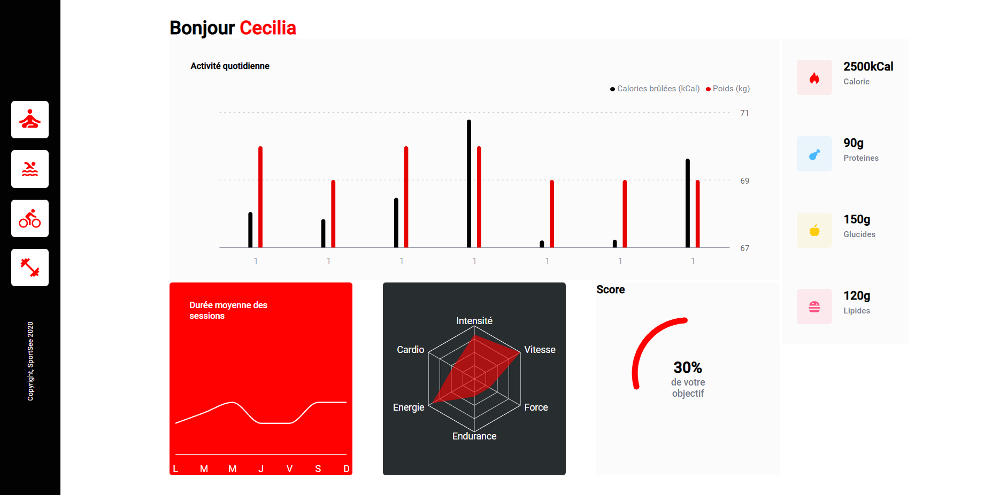

# OC-P12-SportSee

**Personnal Dashboard**
<kbd></kbd>

> PROBLEMATIQUE
> Créer un tableau de bord analytique de performances sportives et indicateurs physiologiques

> BESOIN
> Afficher les données utlisateur sous forme de graphique

## Compétences développées

- [x] Récupérer les données depuis l'API
- [x] Manipuler / Corriger les données selon le besoin
- [x] Repésenter graphiquement les données
- [x] Développer des Routes imbriquées
- [x] Gérer les différents cas liés à la réponse de la requête API
- [x] Développer une logique de code partitionné dans des composants réutilisables

## Ressources fournies

- [Maquette](https://www.figma.com/file/BMomGVZqLZb811mDMShpLu/UI-design-Sportify-FR?node-id=0%3A1)
- [Kanban](https://www.notion.so/Tableau-de-bord-SportSee-6686aa4b5f44417881a4884c9af5669e)
